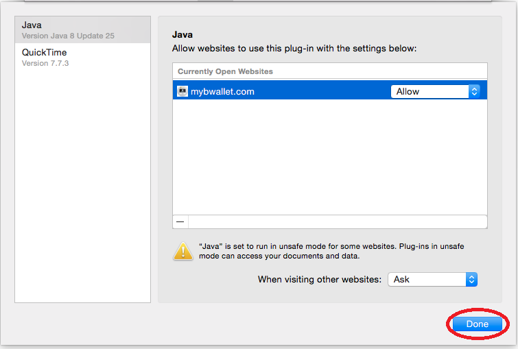

Install plugin for Safari OS X
================

Download Java
---------------------

.. image:: images/osx/safari/2.png
.. image:: images/osx/safari/3.png

Install Java
--------------
.. raw:: html

    See <a href="osx-install.html" target="_blank">Install Java on Mac OS X</a>  

Restart your browser
--------------
Please restart your browser and revisit the mybwallet.com

Enable Java in browser
--------------

New Java Security Settings in Safari
--------------
Apple (Safari) and Oracle (Java) recently made some changes to Java applet implementation on Macs to improve security. For MyBWallet.com users this means that you have to explicitly permit BWallet applet to communicate with HID device on your Mac. This can be done in the three small steps described below.

Refresh the page
--------------
Refresh the page in your Web browser

Enable BWallet plugin
--------------
.. image:: images/osx/safari/12.png

Setup completed
--------------
.. image:: images/osx/safari/13.png
