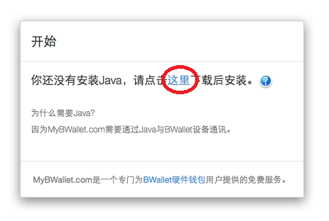
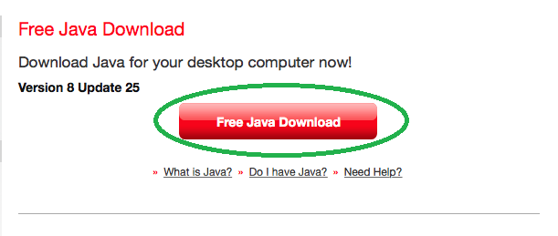
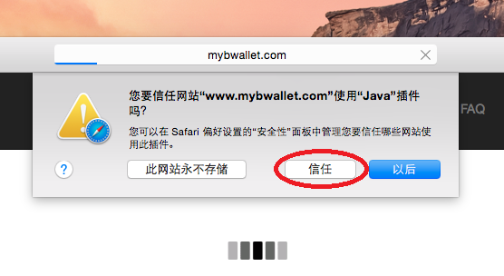
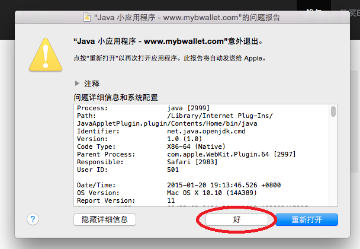
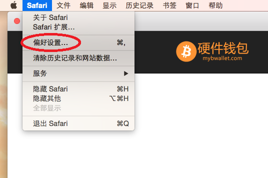
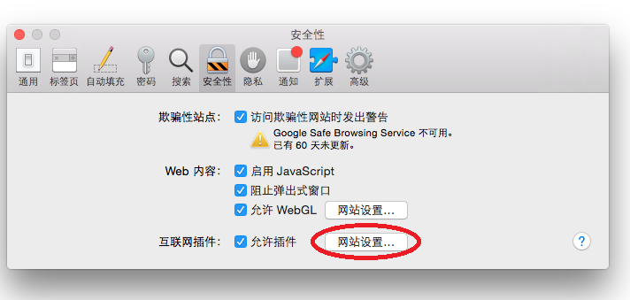
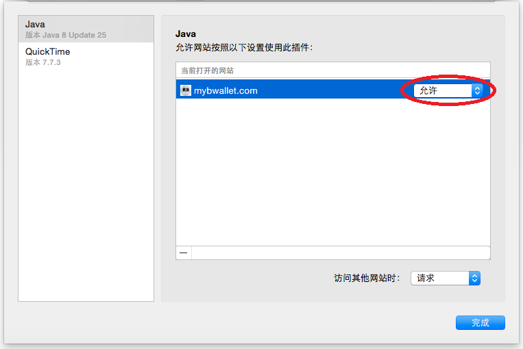
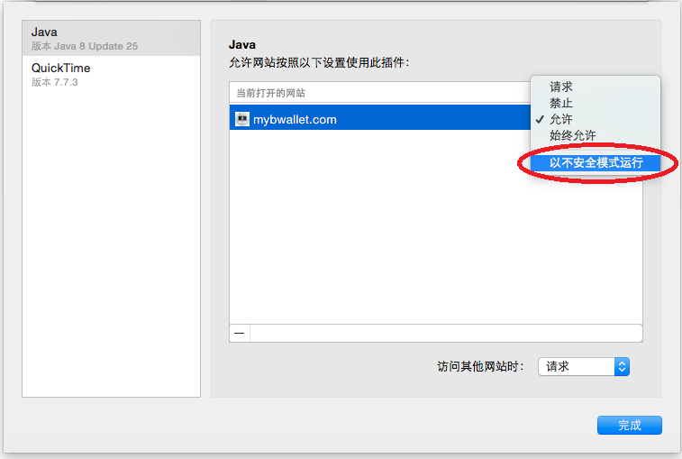
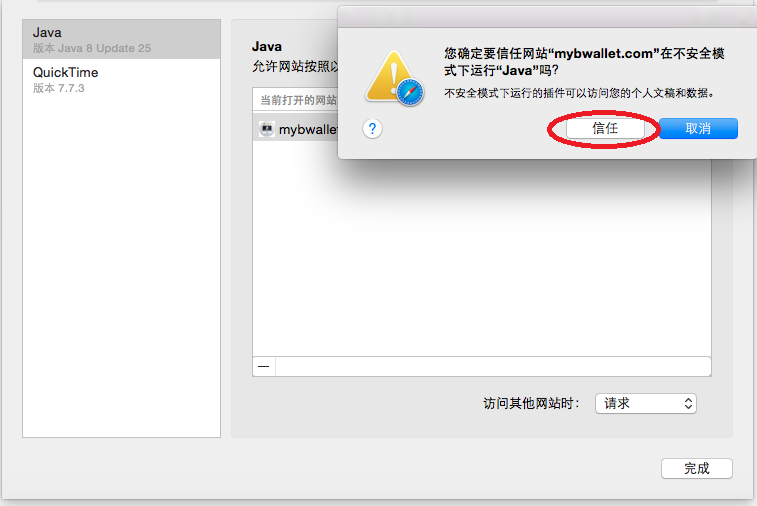
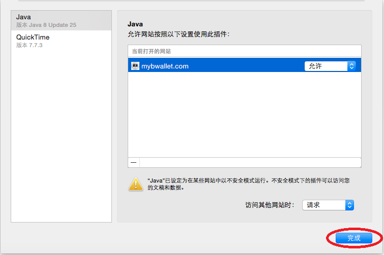

在OS X Safari安装插件
================

下载Java
---------------------

.. image:: images/osx/safari/3.png

安装Java
--------------
.. raw:: html

    请阅读<a href="osx-install.html" target="_blank">在OS X安装Java</a>  

重启浏览器
--------------
浏览器重启后请重新访问mybwallet.com

允许Java在浏览器运行
--------------

赋予Java更高的运行权限
--------------
在Mac OS X的Safari浏览器，Java插件默认没有访问文件、外部设备等权限，必须提高Java的运行权限才能使用BWallet设备，否则将会出现如下图的错误。

如何为Java设置更高运行权限？

刷新网页
--------------
刷新mybwallet.com

允许BWallet插件运行
--------------
.. image:: images/osx/safari/12.png

完成安装
--------------
.. image:: images/osx/safari/13.png
