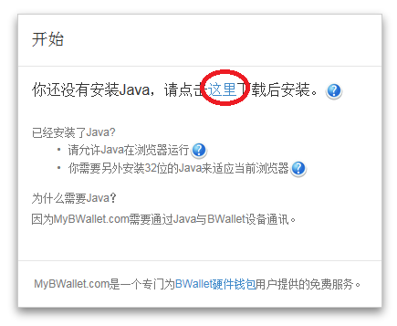
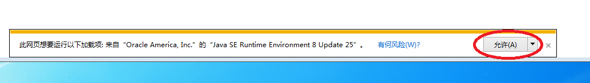
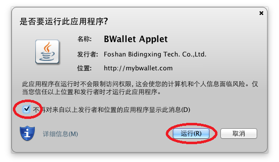

在Windows IE安装插件
================

下载Java
---------------------

安装Java
--------------
.. raw:: html

    请阅读<a href="win-install.html" target="_blank">在Windows安装Java</a>  

重启浏览器
--------------
浏览器重启后请重新访问mybwallet.com

允许Java在浏览器运行
--------------

允许BWallet插件运行
--------------

完成安装
--------------

